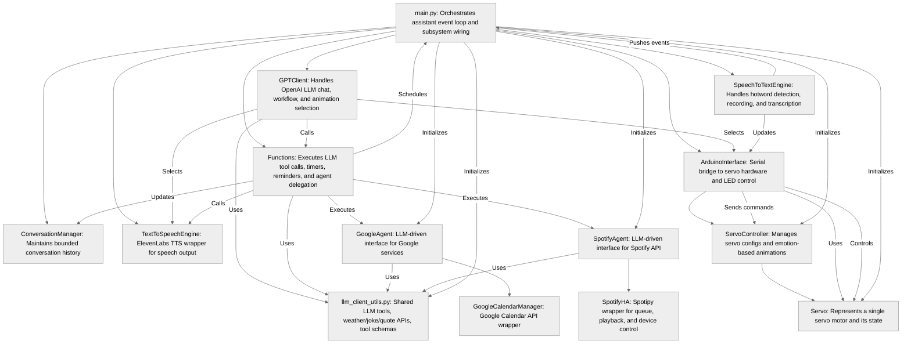

```mermaid
---
config:
  layout: dagre
  look: classic
  theme: neutral
---
flowchart TD
  Main[main.py: Orchestrates assistant event loop and subsystem wiring]
  ConversationManager[ConversationManager: Maintains bounded conversation history]
  GPTClient[GPTClient: Handles OpenAI LLM chat, workflow, and animation selection]
  Functions[Functions: Executes LLM tool calls, timers, reminders, and agent delegation]
  TextToSpeechEngine[TextToSpeechEngine: ElevenLabs TTS wrapper for speech output]
  SpeechToTextEngine[SpeechToTextEngine: Handles hotword detection, recording, and transcription]
  ArduinoInterface[ArduinoInterface: Serial bridge to servo hardware and LED control]
  ServoController[ServoController: Manages servo configs and emotion-based animations]
  Servo[Servo: Represents a single servo motor and its state]
  GoogleAgent[GoogleAgent: LLM-driven interface for Google services]
  GoogleCalendarManager[GoogleCalendarManager: Google Calendar API wrapper]
  SpotifyAgent[SpotifyAgent: LLM-driven interface for Spotify API]
  SpotifyHA[SpotifyHA: Spotipy wrapper for queue, playback, and device control]
  llm_utils[llm_client_utils.py: Shared LLM tools, weather/joke/quote APIs, tool schemas]

  Main --> ConversationManager
  Main --> GPTClient
  Main --> Functions
  Main --> TextToSpeechEngine
  Main --> SpeechToTextEngine
  Main --> ArduinoInterface
  ArduinoInterface --> ServoController
  ServoController --> Servo
  ArduinoInterface -->|Uses| Servo
  GPTClient -->|Uses| llm_utils
  GPTClient -->|Calls| Functions
  GPTClient -->|Selects| TextToSpeechEngine
  GPTClient -->|Selects| ArduinoInterface
  Functions -->|Executes| GoogleAgent
  Functions -->|Executes| SpotifyAgent
  Functions -->|Uses| llm_utils
  Functions -->|Schedules| Main
  Functions -->|Calls| TextToSpeechEngine
  Functions -->|Updates| ConversationManager
  SpeechToTextEngine -->|Updates| ArduinoInterface
  SpeechToTextEngine -->|Pushes events| Main
  ArduinoInterface -->|Sends commands| ServoController
  ArduinoInterface -->|Controls| Servo
  GoogleAgent --> GoogleCalendarManager
  GoogleAgent -->|Uses| llm_utils
  SpotifyAgent --> SpotifyHA
  SpotifyAgent -->|Uses| llm_utils
  Main -->|Initializes| llm_utils
  Main -->|Initializes| GoogleAgent
  Main -->|Initializes| SpotifyAgent
  Main -->|Initializes| ServoController
  Main -->|Initializes| Servo
```
