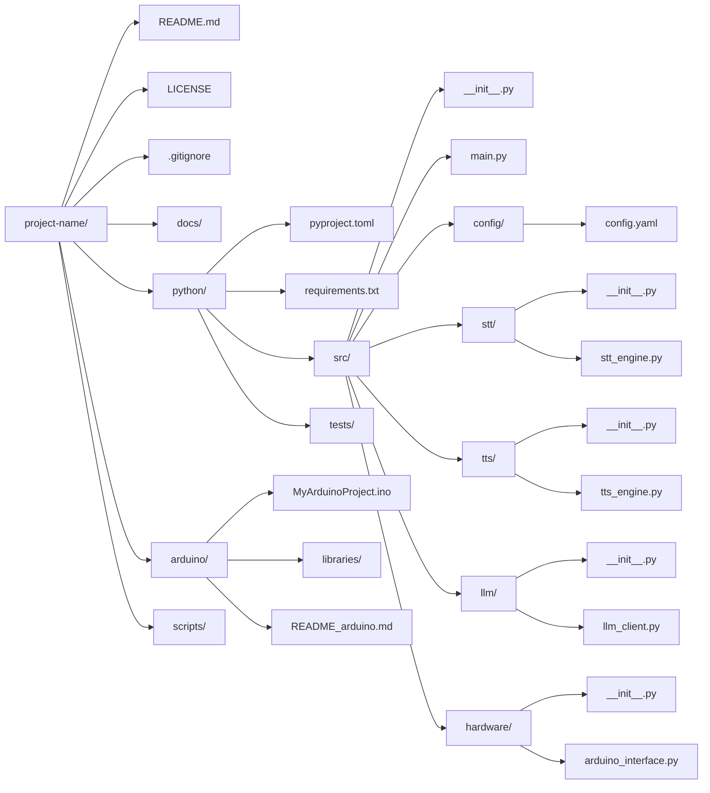

structure

project-name/
├── README.md                # Project overview, installation, and usage instructions
├── LICENSE                  # License information
├── .gitignore               # Specify files/directories to ignore in version control
├── docs/                    # Documentation (design docs, API references, diagrams)
│   └── ...
├── python/                  # Python application code
│   ├── pyproject.toml       # Project configuration (or setup.py) for packaging & dependencies
│   ├── requirements.txt     # List of dependencies (if not solely using pyproject.toml)
│   ├── src/                 # Main Python package(s)
│   │   ├── __init__.py
│   │   ├── main.py          # Application entry point for TTS/STT/LLM workflow
│   │   ├── config/          # Configuration files (JSON, YAML, etc.)
│   │   │   └── config.yaml
│   │   ├── stt/             # Speech-to-text modules
│   │   │   ├── __init__.py
│   │   │   └── stt_engine.py
│   │   ├── tts/             # Text-to-speech modules
│   │   │   ├── __init__.py
│   │   │   └── tts_engine.py
│   │   ├── llm/             # Large Language Model integration
│   │   │   ├── __init__.py
│   │   │   └── llm_client.py
│   │   └── hardware/        # Interface for communicating with Arduino (e.g., via Serial)
│   │       ├── __init__.py
│   │       └── arduino_interface.py
│   └── tests/               # Unit/integration tests for Python code
│       ├── __init__.py
│       ├── test_stt.py
│       ├── test_tts.py
│       ├── test_llm.py
│       └── test_arduino.py
├── arduino/                 # Arduino firmware code
│   ├── MyArduinoProject.ino # Main Arduino sketch (hardware control)
│   ├── libraries/           # (Optional) Custom Arduino libraries
│   └── README_arduino.md    # Arduino-specific documentation (wiring diagrams, upload instructions, etc.)
└── scripts/                 # Additional helper/automation scripts (deployment, build, etc.)

