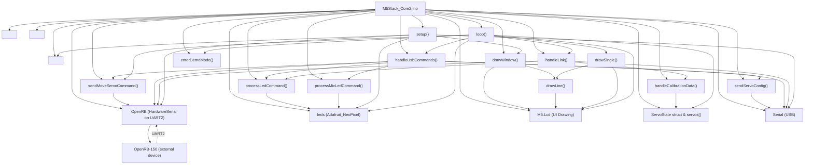

# AI Directory Structure

```mermaid
graph TD
    M5Stack_Core2_ino["M5Stack_Core2.ino"]

    %% External Libraries
    M5Unified["<M5Unified.h>"]
    HardwareSerial["<HardwareSerial.h>"]
    Adafruit_NeoPixel["<Adafruit_NeoPixel.h>"]

    %% Relationships (imports/includes)
    M5Stack_Core2_ino --> M5Unified
    M5Stack_Core2_ino --> HardwareSerial
    M5Stack_Core2_ino --> Adafruit_NeoPixel

    %% HardwareSerial instance for UART2
    OpenRB["OpenRB (HardwareSerial on UART2)"]
    M5Stack_Core2_ino --> OpenRB

    %% NeoPixel LED strip
    NeoPixelStrip["leds (Adafruit_NeoPixel)"]
    M5Stack_Core2_ino --> NeoPixelStrip

    %% UI and LCD
    LCD["M5.Lcd (UI Drawing)"]
    M5Stack_Core2_ino --> LCD

    %% Servo State and Bookkeeping
    ServoState["ServoState struct & servos[]"]
    M5Stack_Core2_ino --> ServoState

    %% USB Serial
    USBSerial["Serial (USB)"]
    M5Stack_Core2_ino --> USBSerial

    %% OpenRB-150 Link
    OpenRB150["OpenRB-150 (external device)"]
    OpenRB --> OpenRB150

    %% LED Command Processing
    processLedCommand["processLedCommand()"]
    processMicLedCommand["processMicLedCommand()"]
    M5Stack_Core2_ino --> processLedCommand
    M5Stack_Core2_ino --> processMicLedCommand
    processLedCommand --> NeoPixelStrip
    processMicLedCommand --> NeoPixelStrip

    %% Servo Command Processing
    sendMoveServoCommand["sendMoveServoCommand()"]
    handleCalibrationData["handleCalibrationData()"]
    sendServoConfig["sendServoConfig()"]
    M5Stack_Core2_ino --> sendMoveServoCommand
    M5Stack_Core2_ino --> handleCalibrationData
    M5Stack_Core2_ino --> sendServoConfig
    sendMoveServoCommand --> OpenRB
    handleCalibrationData --> ServoState
    sendServoConfig --> USBSerial

    %% UI Drawing Functions
    drawWindow["drawWindow()"]
    drawLine["drawLine()"]
    drawSingle["drawSingle()"]
    M5Stack_Core2_ino --> drawWindow
    drawWindow --> drawLine
    drawSingle --> drawLine
    drawWindow --> LCD
    drawLine --> LCD
    drawSingle --> LCD

    %% Handlers
    handleUsbCommands["handleUsbCommands()"]
    handleLink["handleLink()"]
    M5Stack_Core2_ino --> handleUsbCommands
    M5Stack_Core2_ino --> handleLink
    handleUsbCommands --> processLedCommand
    handleUsbCommands --> processMicLedCommand
    handleUsbCommands --> sendServoConfig
    handleUsbCommands --> sendMoveServoCommand
    handleUsbCommands --> USBSerial
    handleUsbCommands --> OpenRB
    handleLink --> processLedCommand
    handleLink --> handleCalibrationData
    handleLink --> OpenRB
    handleLink --> USBSerial

    %% Demo Mode
    enterDemoMode["enterDemoMode()"]
    M5Stack_Core2_ino --> enterDemoMode

    %% Main Loop
    setup["setup()"]
    loop["loop()"]
    M5Stack_Core2_ino --> setup
    M5Stack_Core2_ino --> loop
    setup --> M5Unified
    setup --> OpenRB
    setup --> NeoPixelStrip
    setup --> drawWindow
    setup --> USBSerial
    loop --> handleLink
    loop --> handleUsbCommands
    loop --> sendMoveServoCommand
    loop --> drawSingle
    loop --> enterDemoMode
    loop --> ServoState
    loop --> LCD
    loop --> NeoPixelStrip

    %% External Device
    OpenRB150 -. UART2 .-> OpenRB
```
