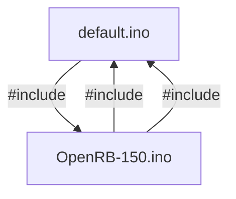

# AI Directory Structure

```mermaid
graph TD
    default_ino["default.ino"]
    OpenRB_150_ino["OpenRB-150.ino"]

    default_ino -->|#include <Dynamixel2Arduino.h>| OpenRB_150_ino
    OpenRB_150_ino -->|#include <Dynamixel2Arduino.h>| default_ino
    OpenRB_150_ino -->|#include <Arduino.h>| default_ino
```
