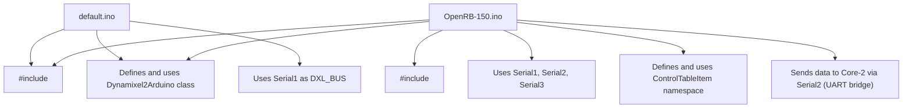

# AI Directory Structure

```mermaid
graph TD
    default_ino["default.ino"]
    openrb_150_ino["OpenRB-150.ino"]

    dynamixel_include["#include <Dynamixel2Arduino.h>"]
    arduino_include["#include <Arduino.h>"]
    serial_usage["Uses Serial1, Serial2, Serial3"]
    dynamixel_class["Defines and uses Dynamixel2Arduino class"]
    control_table_ns["Defines and uses ControlTableItem namespace"]
    uart_bridge["Sends data to Core-2 via Serial2 (UART bridge)"]
    dxl_bus["Uses Serial1 as DXL_BUS"]

    default_ino --> dynamixel_include
    default_ino --> dynamixel_class
    default_ino --> dxl_bus

    openrb_150_ino --> dynamixel_include
    openrb_150_ino --> arduino_include
    openrb_150_ino --> serial_usage
    openrb_150_ino --> dynamixel_class
    openrb_150_ino --> control_table_ns
    openrb_150_ino --> uart_bridge
```
