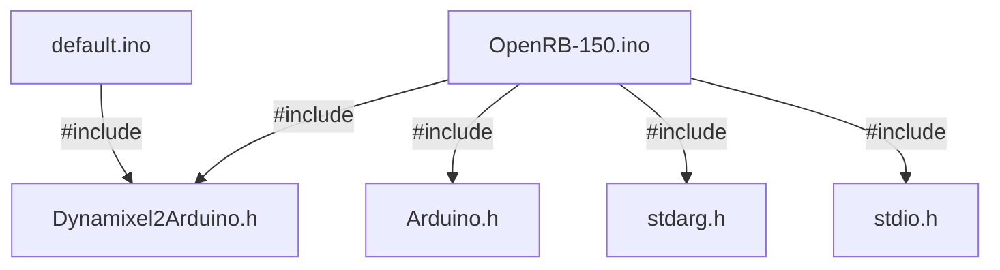

# AI Directory Structure

```mermaid
graph TD
    default_ino["default.ino"]
    OpenRB_150_ino["OpenRB-150.ino"]

    default_ino -->|#include <Dynamixel2Arduino.h>| Dynamixel2Arduino_lib["Dynamixel2Arduino.h"]
    OpenRB_150_ino -->|#include <Dynamixel2Arduino.h>| Dynamixel2Arduino_lib
    OpenRB_150_ino -->|#include <Arduino.h>| Arduino_lib["Arduino.h"]
    OpenRB_150_ino -->|#include <stdarg.h>| stdarg_lib["stdarg.h"]
    OpenRB_150_ino -->|#include <stdio.h>| stdio_lib["stdio.h"]

    %% Both .ino files are independent sketches, but both use Dynamixel2Arduino
    %% OpenRB-150.ino uses Serial aliases and functionally overlaps with default.ino in hardware usage

    %% No direct function or class usage between the two .ino files, but both depend on Dynamixel2Arduino
```
