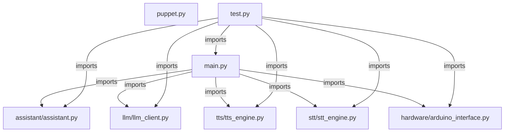

# AI Directory Structure

```mermaid
graph TD
    main_py[main.py]
    puppet_py[puppet.py]
    test_py[test.py]

    %% main.py relationships
    main_py -->|imports| assistant_assistant[assistant/assistant.py]
    main_py -->|imports| llm_llm_client[llm/llm_client.py]
    main_py -->|imports| tts_tts_engine[tts/tts_engine.py]
    main_py -->|imports| stt_stt_engine[stt/stt_engine.py]
    main_py -->|imports| hardware_arduino_interface[hardware/arduino_interface.py]

    %% test.py relationships
    test_py -->|imports| main_py
    test_py -->|imports| assistant_assistant
    test_py -->|imports| llm_llm_client
    test_py -->|imports| tts_tts_engine
    test_py -->|imports| stt_stt_engine
    test_py -->|imports| hardware_arduino_interface

    %% puppet.py is standalone (no local imports)
```
