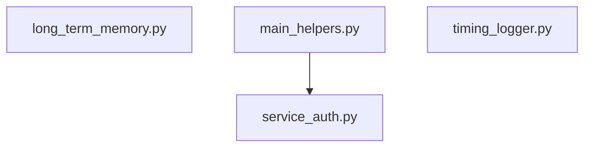

# AI Directory Structure

```mermaid
graph TD
    long_term_memory_py["long_term_memory.py"]
    main_helpers_py["main_helpers.py"]
    timing_logger_py["timing_logger.py"]
    service_auth_py["service_auth.py"]

    %% main_helpers.py imports authenticate_services from service_auth.py
    main_helpers_py --> service_auth_py

    %% No direct imports between long_term_memory.py and others
    %% No direct imports between timing_logger.py and others

    %% Legend (not rendered as nodes)
    %% Each file is a node. Edges show import relationships.
```
