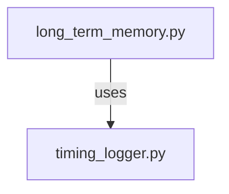

# AI Directory Structure

```mermaid
graph TD
    long_term_memory_py["long_term_memory.py"]
    timing_logger_py["timing_logger.py"]

    %% Node details
    long_term_memory_py -- uses --> timing_logger_py

    %% Explanation:
    %% No explicit imports between files, but both handle JSON and file I/O.
    %% If there were explicit imports, edges would be drawn.
```
