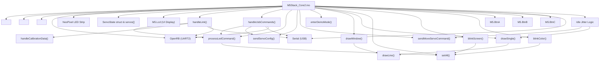

# AI Directory Structure

```mermaid
graph TD
    M5Stack_Core2_ino["M5Stack_Core2.ino"]

    %% External Libraries/Dependencies
    M5Unified["<M5Unified.h>"]
    HardwareSerial["<HardwareSerial.h>"]
    Adafruit_NeoPixel["<Adafruit_NeoPixel.h>"]

    %% Relationships (includes/imports)
    M5Stack_Core2_ino --> M5Unified
    M5Stack_Core2_ino --> HardwareSerial
    M5Stack_Core2_ino --> Adafruit_NeoPixel

    %% HardwareSerial instance for OpenRB-150
    OpenRB["OpenRB (UART2)"]
    M5Stack_Core2_ino --> OpenRB

    %% NeoPixel LED strip
    NeoPixelStrip["NeoPixel LED Strip"]
    M5Stack_Core2_ino --> NeoPixelStrip

    %% Servo State
    ServoState["ServoState struct & servos[]"]
    M5Stack_Core2_ino --> ServoState

    %% UI/Display
    M5Lcd["M5.Lcd (UI Display)"]
    M5Stack_Core2_ino --> M5Lcd

    %% Main Loop Handlers
    handleLink["handleLink()"]
    handleUsbCommands["handleUsbCommands()"]
    M5Stack_Core2_ino --> handleLink
    M5Stack_Core2_ino --> handleUsbCommands

    %% LED Command Processing
    processLedCommand["processLedCommand()"]
    M5Stack_Core2_ino --> processLedCommand
    handleLink --> processLedCommand
    handleUsbCommands --> processLedCommand

    %% Calibration Data
    handleCalibrationData["handleCalibrationData()"]
    handleLink --> handleCalibrationData

    %% Servo Config
    sendServoConfig["sendServoConfig()"]
    handleUsbCommands --> sendServoConfig
    M5Stack_Core2_ino --> sendServoConfig

    %% Servo Movement
    sendMoveServoCommand["sendMoveServoCommand()"]
    M5Stack_Core2_ino --> sendMoveServoCommand

    %% Demo Mode
    enterDemoMode["enterDemoMode()"]
    M5Stack_Core2_ino --> enterDemoMode

    %% Drawing Helpers
    drawWindow["drawWindow()"]
    drawLine["drawLine()"]
    drawSingle["drawSingle()"]
    M5Stack_Core2_ino --> drawWindow
    drawWindow --> drawLine
    M5Stack_Core2_ino --> drawSingle
    drawSingle --> drawLine

    %% LED/Blink Helpers
    setAll["setAll()"]
    blinkScreen["blinkScreen()"]
    blinkColor["blinkColor()"]
    M5Stack_Core2_ino --> setAll
    M5Stack_Core2_ino --> blinkScreen
    M5Stack_Core2_ino --> blinkColor
    processLedCommand --> setAll
    blinkScreen --> setAll
    blinkColor --> setAll

    %% Button Handlers (in loop)
    BtnA["M5.BtnA"]
    BtnB["M5.BtnB"]
    BtnC["M5.BtnC"]
    M5Stack_Core2_ino --> BtnA
    M5Stack_Core2_ino --> BtnB
    M5Stack_Core2_ino --> BtnC

    %% Serial Communication
    SerialUSB["Serial (USB)"]
    M5Stack_Core2_ino --> SerialUSB
    handleUsbCommands --> SerialUSB
    handleLink --> SerialUSB

    %% OpenRB-150 Communication
    handleLink --> OpenRB
    handleUsbCommands --> OpenRB

    %% Idle Jitter Logic (in loop)
    IdleJitter["Idle Jitter Logic"]
    M5Stack_Core2_ino --> IdleJitter
    IdleJitter --> sendMoveServoCommand
    IdleJitter --> drawSingle
```
