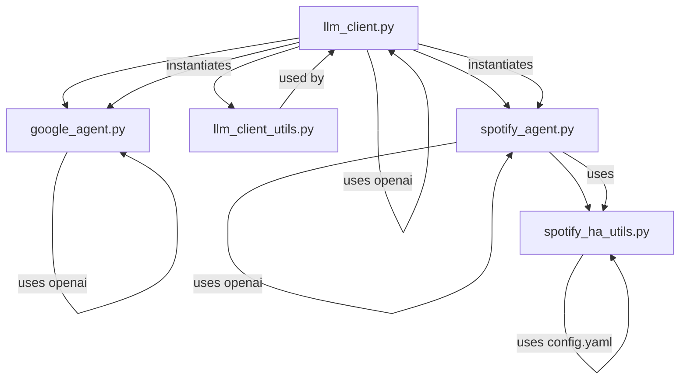

# AI Directory Structure

```mermaid
graph TD
    google_agent_py["google_agent.py"]
    llm_client_py["llm_client.py"]
    llm_client_utils_py["llm_client_utils.py"]
    spotify_agent_py["spotify_agent.py"]
    spotify_ha_utils_py["spotify_ha_utils.py"]

    %% Imports and relationships
    llm_client_py --> google_agent_py
    llm_client_py --> spotify_agent_py
    llm_client_py --> llm_client_utils_py

    spotify_agent_py --> spotify_ha_utils_py

    %% google_agent.py uses config.yaml (not a code file, so not shown as a node)
    google_agent_py -->|uses config.yaml| google_agent_py

    %% llm_client_utils.py is a utilities file, used by llm_client.py
    llm_client_utils_py -->|used by| llm_client_py

    %% spotify_agent.py uses config.yaml (not a code file, so not shown as a node)
    spotify_agent_py -->|uses config.yaml| spotify_agent_py

    %% spotify_ha_utils.py uses config.yaml (not a code file, so not shown as a node)
    spotify_ha_utils_py -->|uses config.yaml| spotify_ha_utils_py

    %% google_agent.py and spotify_agent.py both depend on openai API
    google_agent_py -->|uses openai| google_agent_py
    spotify_agent_py -->|uses openai| spotify_agent_py
    llm_client_py -->|uses openai| llm_client_py

    %% google_agent.py and llm_client.py both use yaml, requests, etc. (not shown as nodes)

    %% llm_client.py: Functions class instantiates GoogleAgent and SpotifyAgent
    llm_client_py -->|instantiates| google_agent_py
    llm_client_py -->|instantiates| spotify_agent_py

    %% spotify_agent.py: SpotifyAgent uses SpotifyHA
    spotify_agent_py -->|uses| spotify_ha_utils_py

    %% llm_client.py: TextToSpeech uses elevenlabs.client (not shown as node)
```
