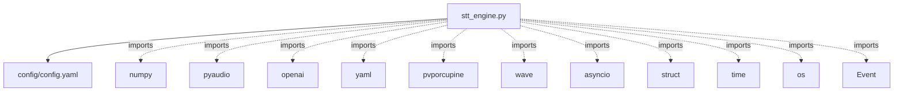

# AI Directory Structure

```mermaid
graph TD
    stt_engine_py["stt_engine.py"]
    config_yaml["config/config.yaml"]
    
    stt_engine_py --> config_yaml
    stt_engine_py -.->|imports| numpy
    stt_engine_py -.->|imports| pyaudio
    stt_engine_py -.->|imports| openai
    stt_engine_py -.->|imports| yaml
    stt_engine_py -.->|imports| pvporcupine
    stt_engine_py -.->|imports| wave
    stt_engine_py -.->|imports| asyncio
    stt_engine_py -.->|imports| struct
    stt_engine_py -.->|imports| time
    stt_engine_py -.->|imports| os
    stt_engine_py -.->|imports| Event
```
