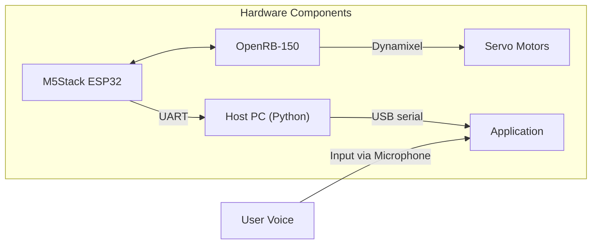

# Architecture Overview

## System Context


The host PC runs the Python application which communicates with the M5Stack Core2 over USB. The Core2 relays commands to the OpenRB-150 which drives the Dynamixel servos. User voice input is captured through a microphone attached to the host.

## Component Breakdown

### `main.py`
Entry point that wires together all modules:
- Loads configuration
- Creates instances of `SpeechToTextEngine`, `GPTClient`, `TextToSpeechEngine` and `ArduinoInterface`
- Runs the async conversation loop

### `assistant/assistant.py`
Maintains conversation history and handles system/user roles.

### `stt/stt_engine.py`
- Records audio, detects hotwords and sends transcribed text
- UART LED feedback using `set_mic_led_color`
- Exposes `hotword_listener` and `record_and_transcribe`

### `tts/tts_engine.py`
- Generates speech with ElevenLabs
- Plays audio using `playsound`

### `llm/llm_client.py`
- Sends conversation context to OpenAI
- Selects servo animations via `reply_with_animation`
- Provides tool execution through `Functions`

### `hardware/arduino_interface.py`
- Serial communication with M5Stack
- Maps emotion names to servo configurations
- Sends LED and servo commands

## Data Flow

1. **Voice**: microphone → `hotword_listener` → `record_and_transcribe`
2. **LLM**: conversation history → `GPTClient.get_text()` → text reply and animation
3. **Hardware**: animation → `ArduinoInterface.set_animation()` → M5Stack → OpenRB-150 → servos
4. **Speech**: text reply → `TextToSpeechEngine.generate_and_play_advanced()` → speaker

Sequence diagram:

```
User -> STT -> main.py -> GPTClient -> ArduinoInterface
     -> TTS -> Speaker
```

## Non-Functional Requirements

- **Scalability**: modular design allows swapping STT/TTS engines
- **Fault Tolerance**: dry-run mode when hardware not detected
- **Security**: API keys loaded from `config.yaml` and not stored in code
- **Performance**: target latency under 1s for STT and TTS operations
