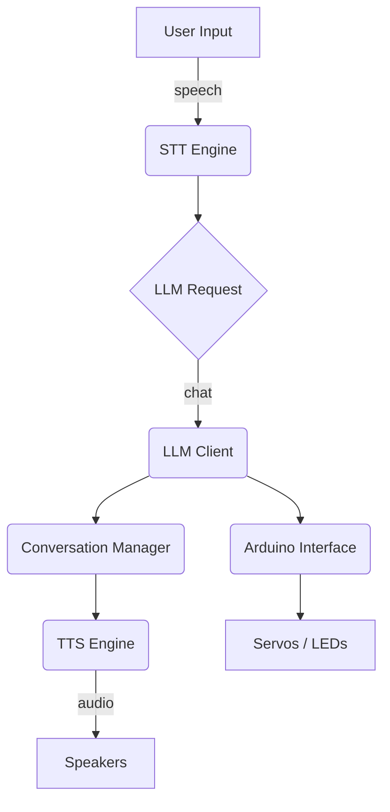
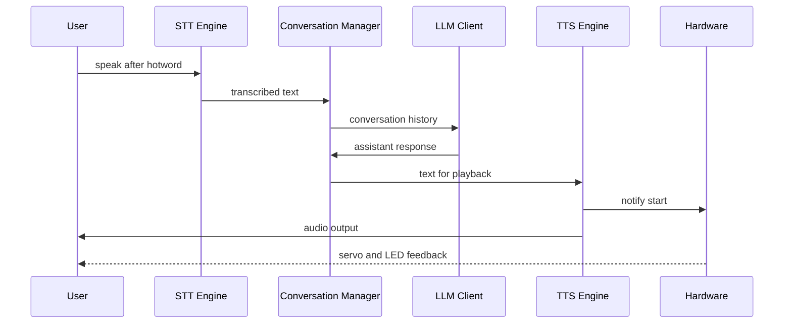

# Project Architecture Overview

This document provides a detailed look at how the Wheatley assistant is structured. The goal is to give a clear picture of the moving parts and how they communicate with each other.

## High-Level Components

1. **Speech to Text (STT)**
   - Implemented in `stt/stt_engine.py`.
   - Uses Porcupine for hotword detection and OpenAI Whisper to transcribe speech once detected.
   - Exposes helper methods for pausing and resuming listening so TTS playback does not interfere with the microphone.
2. **Conversation Manager**
   - Located in `assistant/assistant.py`.
   - Maintains a bounded history buffer and continually refreshes the system prompt with the current time and day.
3. **Large Language Model (LLM)**
   - Accessed through `llm/llm_client.py`.
   - Wraps OpenAI's chat API and provides tooling for workflow execution, such as calendar or Spotify integration.
4. **Text to Speech (TTS)**
   - Provided by `tts/tts_engine.py`.
   - Converts assistant responses into audio using the ElevenLabs API and streams playback to the user.
5. **Hardware Interface**
   - Managed by `hardware/arduino_interface.py`.
   - Sends servo and LED commands to an Arduino-based controller for expressive animations.

## Component Diagram

The diagram illustrates how user input flows through the STT engine into the LLM client. Responses are spoken via the TTS engine and can trigger hardware animations.

## Execution Flow

`main.py` acts as the conductor:

1. **Initialisation** – Reads `config/config.yaml` and creates instances of STT, TTS, the LLM client and the Arduino interface.
2. **Welcome** – Prints an ASCII banner and sends a greeting through the TTS engine.
3. **Conversation Loop** – Repeatedly:
   - Waits for either text input or the configured hotword.
   - Sends the collected conversation history to the LLM.
   - Executes any tool calls (for example, to read the calendar or control music).
   - Streams the assistant's reply through the TTS engine and triggers a matching animation via the Arduino.
4. **Shutdown** – Cleans up resources when the user types or says `exit`.

### Sequence Diagram

## Additional Utilities

- `install_prerequisites.py` installs packages listed in `requirements.txt`.
- `docs/tts_and_hotword_flow.md` describes speech synthesis and hotword detection in depth.
- `old_inspiration.py` is prototype code kept for reference.
- `docs/component_communication.md` maps how each Python module talks to the others.
- `docs/detailed_event_flow.md` walks through the full event loop step by step.

This modular architecture makes it easy to swap out individual components. For example, you could replace the STT engine with another speech recogniser or use a different TTS provider without touching the rest of the system.

