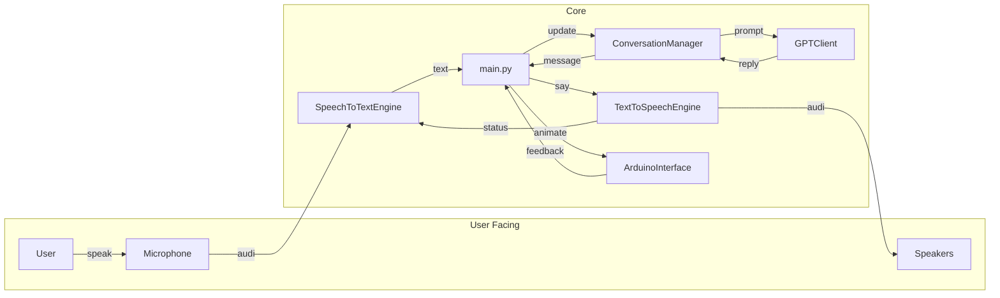

# Component Communication Details

This document provides an exhaustive look at how the Python modules interact during a normal run of the Wheatley assistant. The goal is to map every significant message passing between scripts.

For a detailed breakdown of the serial protocol used to talk to the M5Stack Core2 and the OpenRB‑150, see [hardware_command_flow.md](hardware_command_flow.md). Keeping the hardware commands separate helps this document stay focused on the software layer.

## Overview

All communication is orchestrated by `main.py`, which spawns asynchronous tasks and hands off work to various subsystems. The assistant is built around a queue-based event loop. Events originate from the user, timers, or hardware callbacks and are processed in order.

## Key Scripts and Interactions

1. **`main.py`**
   - Bootstraps the assistant and creates the event queue.
   - Dispatches user input and hotword events to the `ConversationManager`.
   - Triggers tool workflows via `GPTClient` and delivers text to `TextToSpeechEngine`.
   - Sends animation commands to `ArduinoInterface`.
2. **`assistant/assistant.py`**
   - Maintains conversation state and appends messages from all sources.
   - Provides helpers for printing and trimming memory.
3. **`llm/llm_client.py`**
   - Calls the OpenAI API and decides when external tools should run.
   - Returns both natural language replies and animation cues.
4. **`stt/stt_engine.py`**
   - Continuously listens for a hotword in a background task.
   - After a hotword, records audio and submits it to Whisper for transcription.
   - Pauses itself whenever the TTS engine is speaking to prevent feedback.
5. **`tts/tts_engine.py`**
   - Streams audio from ElevenLabs and notifies `ArduinoInterface` when playback starts and ends.
6. **`hardware/arduino_interface.py`**
   - Sends serial messages to the robot head controller.
   - Provides servo position feedback used for debugging.

The figure below summarises these connections.

## Message Ordering

The queue in `main.py` ensures that voice input, text commands, timers, and hardware callbacks are processed sequentially. Each component emits events with a source tag so the manager can store them appropriately.

- **Voice Input** – produced by `SpeechToTextEngine` as soon as transcription completes.
- **Text Commands** – read from the terminal by the `user_input_producer` task.
- **Tool Results** – returned by `Functions.execute_workflow` and injected into the conversation as system messages.
- **Hardware Events** – such as servo errors, forwarded from `ArduinoInterface`.

Understanding this flow helps when adding new integrations. New sources simply place events onto the queue and existing logic remains unchanged.

