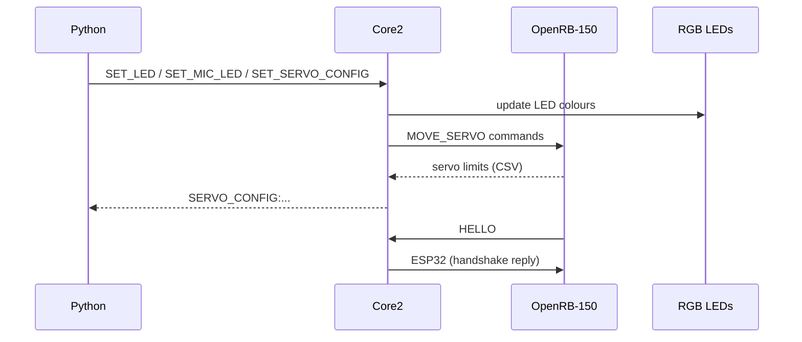

# Hardware Command Flow

This document covers the messages exchanged between the Python code, the M5Stack Core2, the OpenRB‑150 board and the RGB LEDs.  It focuses purely on the serial commands so other documents can concentrate on software or event flow.

## Overview

Three devices cooperate:

1. **Python application** – runs on the host computer and sends commands over USB.
2. **M5Stack Core2** – acts as a bridge and user interface.  It receives USB commands, drives the LED strip and forwards servo instructions to the OpenRB‑150 via UART2.
3. **OpenRB‑150** – controls the Dynamixel servos and reports calibration data back to the Core2.

The diagram below shows the direction of each message type.



## Command Reference

### LED Control
- `SET_LED;R=<r>;G=<g>;B=<b>` – sets all LEDs to the specified colour.
- `SET_MIC_LED;IDX=<i>;R=<r>;G=<g>;B=<b>` – changes the LED used as microphone indicator.

Both commands are sent from Python to the Core2.  The sketch immediately updates the NeoPixel strip and echoes a short confirmation message over USB.

### Servo Configuration
- `SET_SERVO_CONFIG:<id>,<target>,<vel>,<idle>,<interval>;...` – updates servo angles and animation parameters in bulk.
- `GET_SERVO_CONFIG` – request the latest calibration table from the Core2.
- `SERVO_CONFIG:<id>,<min>,<max>,<ping>;...` – response emitted by the Core2 after calibration or when requested.

Python issues `GET_SERVO_CONFIG` during start‑up and whenever calibration data is needed.  The Core2 forwards the information received from the OpenRB‑150.  Individual servo move commands are generated when animations run:

- `MOVE_SERVO;ID=<id>;TARGET=<deg>;VELOCITY=<deg/s>` – forwarded by the Core2 to the OpenRB‑150 which then drives the Dynamixel bus.

### Handshake
During boot the OpenRB‑150 repeatedly sends `HELLO` over the UART link.  The Core2 replies with `ESP32`.  If the Core2 does not respond within ten seconds the OpenRB‑150 enters a dry‑run mode and skips calibration.

```mermaid
sequenceDiagram
    participant R as OpenRB-150
    participant C as Core2

    loop until timeout
        R->>C: HELLO
        alt reply received
            C->>R: ESP32
            R->>R: normal operation
            break
        end
    end
    alt timeout
        R->>R: dry-run mode
    end
```

## Related Documentation
- [architecture_overview.md](architecture_overview.md) – big-picture structure of the application.
- [component_communication.md](component_communication.md) – how Python modules pass events around.
- [detailed_event_flow.md](detailed_event_flow.md) – a step-by-step walk through of the async loop.

