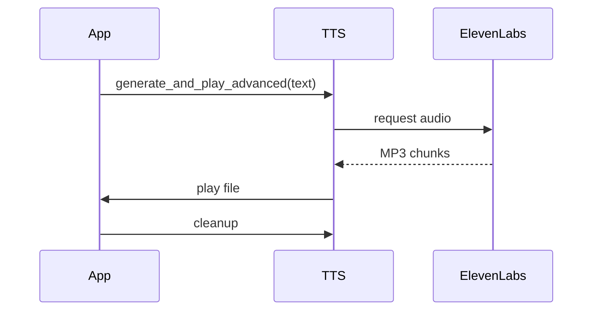
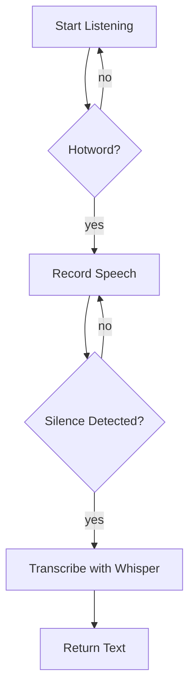

# TTS and Hotword Flow

This document dives deeper into how Wheatley handles text‑to‑speech (TTS) output and hotword detection for speech‑to‑text (STT). The aim is to make the sequence of events clear and provide visual aids where possible.

## Text to Speech
1. **Initialisation** – `TextToSpeechEngine` loads settings from `config/config.yaml` when created. It sets up a persistent ElevenLabs client so network connections are reused.
2. **Generating Speech** – `generate_and_play_advanced(text)` requests MP3 chunks from the ElevenLabs API. Chunks are streamed to a temporary file so large responses do not block memory.
3. **Playback** – The temporary file is played with `playsound`. When playback completes the file is immediately deleted.

### Sequence Diagram

Using `NamedTemporaryFile` ensures no stray audio files remain on disk and keeps the implementation lightweight.

## Hotword Management
1. **Listening Loop** – `SpeechToTextEngine.listen_for_hotword()` builds a Porcupine detector and reads microphone frames until a keyword is recognised.
2. **Detection** – Each frame is scanned for one of the configured hotwords. When a match occurs the index of the hotword is returned.
3. **Integration** – While TTS is speaking the engine pauses listening to avoid false triggers and resumes afterwards.
4. **Transcription** – After the hotword, speech is recorded until a short silence is detected. The audio is then submitted to OpenAI Whisper for transcription.

### Flowchart

The engine exposes `pause_listening()` and `resume_listening()` helpers which `main.py` uses when playing TTS output. This coordination keeps hotword detection responsive without missing user commands.

