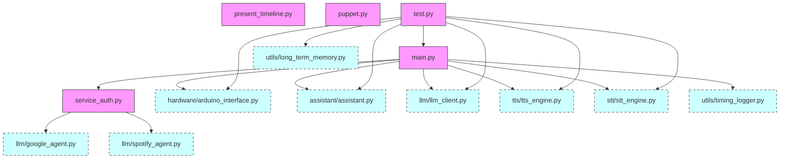

# AI Directory Structure

```mermaid
graph TD
    main_py["main.py"]
    present_timeline_py["present_timeline.py"]
    puppet_py["puppet.py"]
    service_auth_py["service_auth.py"]
    test_py["test.py"]

    %% main.py imports
    main_py --> service_auth_py
    main_py --> hardware_arduino_interface["hardware/arduino_interface.py"]
    main_py --> assistant_assistant["assistant/assistant.py"]
    main_py --> llm_llm_client["llm/llm_client.py"]
    main_py --> tts_tts_engine["tts/tts_engine.py"]
    main_py --> stt_stt_engine["stt/stt_engine.py"]
    main_py --> utils_timing_logger["utils/timing_logger.py"]

    %% service_auth.py imports
    service_auth_py --> llm_google_agent["llm/google_agent.py"]
    service_auth_py --> llm_spotify_agent["llm/spotify_agent.py"]

    %% test.py imports
    test_py --> main_py
    test_py --> assistant_assistant
    test_py --> llm_llm_client
    test_py --> tts_tts_engine
    test_py --> stt_stt_engine
    test_py --> hardware_arduino_interface
    test_py --> utils_long_term_memory["utils/long_term_memory.py"]

    %% Notes for present_timeline.py and puppet.py
    %% These are standalone GUIs and do not import from the others in this set

    %% Show test.py depends on main.py and all assistant modules

    %% File nodes
    classDef file fill:#f9f,stroke:#333,stroke-width:1px;
    main_py:::file
    present_timeline_py:::file
    puppet_py:::file
    service_auth_py:::file
    test_py:::file

    %% External/Local module nodes (not files in this directory)
    classDef ext fill:#cff,stroke:#333,stroke-width:1px,stroke-dasharray: 5 5;
    hardware_arduino_interface:::ext
    assistant_assistant:::ext
    llm_llm_client:::ext
    tts_tts_engine:::ext
    stt_stt_engine:::ext
    utils_timing_logger:::ext
    utils_long_term_memory:::ext
    llm_google_agent:::ext
    llm_spotify_agent:::ext
```
