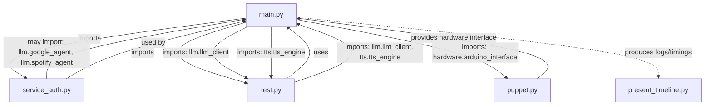

# AI Directory Structure

```mermaid
graph TD
    main_py["main.py"]
    present_timeline_py["present_timeline.py"]
    puppet_py["puppet.py"]
    service_auth_py["service_auth.py"]
    test_py["test.py"]

    %% main.py imports and uses
    main_py -->|"imports"| service_auth_py
    main_py -->|"imports"| test_py
    main_py -->|"imports: hardware.arduino_interface"| puppet_py
    main_py -->|"imports: llm.llm_client"| test_py
    main_py -->|"imports: tts.tts_engine"| test_py

    %% test.py uses LLM and TTS
    test_py -->|"uses"| main_py

    %% present_timeline.py is standalone (loads logs/timings)
    %% No code-level dependency, but visualizes outputs of main.py (e.g., assistant.log, timings.json)
    main_py -.->|"produces logs/timings"| present_timeline_py

    %% service_auth.py is imported by main.py (for authentication)
    service_auth_py -->|"may import: llm.google_agent, llm.spotify_agent"| main_py

    %% puppet.py is GUI for hardware, imported by main.py for ArduinoInterface
    puppet_py -->|"provides hardware interface"| main_py

    %% test.py imports llm.llm_client and tts.tts_engine, which are also used by main.py
    test_py -->|"imports: llm.llm_client, tts.tts_engine"| main_py

    %% service_auth.py is standalone but used by main.py
    service_auth_py -->|"used by"| main_py
```
