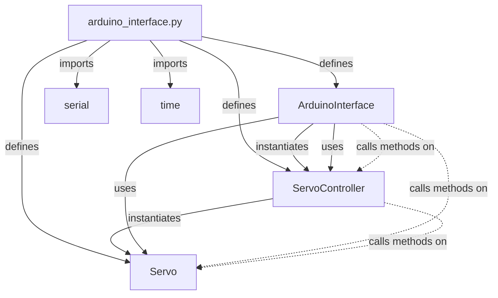

# AI Directory Structure

```mermaid
graph TD
    arduino_interface.py["arduino_interface.py"]
    %% Classes
    arduino_interface.py -->|defines| ArduinoInterface
    arduino_interface.py -->|defines| Servo
    arduino_interface.py -->|defines| ServoController

    %% Internal usage
    ArduinoInterface -->|instantiates| ServoController
    ServoController -->|instantiates| Servo

    ArduinoInterface -->|uses| ServoController
    ArduinoInterface -->|uses| Servo

    %% External dependencies
    arduino_interface.py -->|imports| serial
    arduino_interface.py -->|imports| time

    %% Relationships
    ArduinoInterface -.->|calls methods on| ServoController
    ArduinoInterface -.->|calls methods on| Servo
    ServoController -.->|calls methods on| Servo

    %% No other files in directory
```
