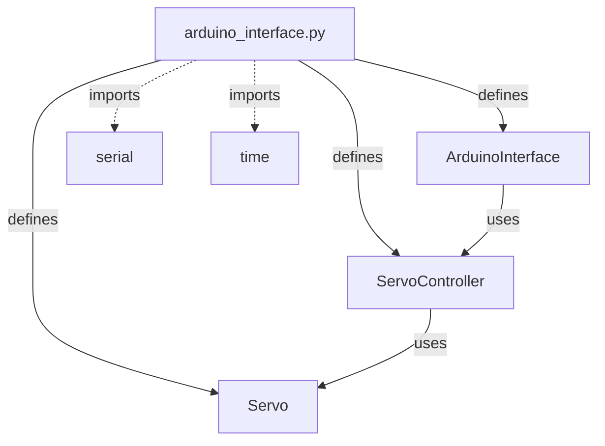

# AI Directory Structure

```mermaid
graph TD
    arduino_interface_py["arduino_interface.py"]

    %% Classes in arduino_interface.py
    arduino_interface_py -->|defines| ArduinoInterface
    arduino_interface_py -->|defines| Servo
    arduino_interface_py -->|defines| ServoController

    %% Internal relationships
    ArduinoInterface -->|uses| ServoController
    ServoController -->|uses| Servo

    %% External dependencies
    arduino_interface_py -.->|imports| serial
    arduino_interface_py -.->|imports| time
```
