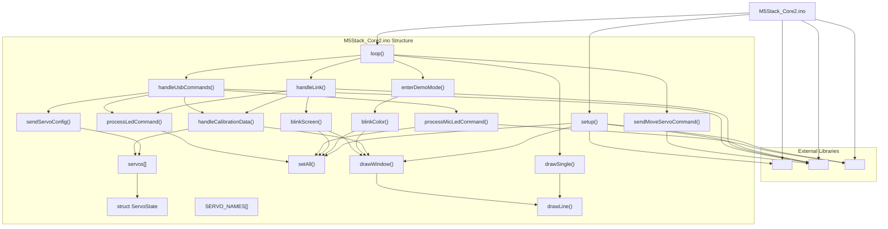

# AI Directory Structure

```mermaid
graph TD
    M5Stack_Core2_ino["M5Stack_Core2.ino"]

    %% External Libraries / Dependencies (not files in directory, but referenced)
    subgraph External_Libraries [External Libraries]
        M5Unified_h["<M5Unified.h>"]
        HardwareSerial_h["<HardwareSerial.h>"]
        Adafruit_NeoPixel_h["<Adafruit_NeoPixel.h>"]
    end

    %% File to library dependencies
    M5Stack_Core2_ino --> M5Unified_h
    M5Stack_Core2_ino --> HardwareSerial_h
    M5Stack_Core2_ino --> Adafruit_NeoPixel_h

    %% Internal structure (modules/classes/functions)
    subgraph M5Stack_Core2_ino_struct [M5Stack_Core2.ino Structure]
        ServoState_struct["struct ServoState"]
        servos_array["servos[]"]
        SERVO_NAMES_array["SERVO_NAMES[]"]
        setAll_func["setAll()"]
        blinkScreen_func["blinkScreen()"]
        blinkColor_func["blinkColor()"]
        processLedCommand_func["processLedCommand()"]
        processMicLedCommand_func["processMicLedCommand()"]
        enterDemoMode_func["enterDemoMode()"]
        drawLine_func["drawLine()"]
        drawWindow_func["drawWindow()"]
        drawSingle_func["drawSingle()"]
        sendMoveServoCommand_func["sendMoveServoCommand()"]
        handleCalibrationData_func["handleCalibrationData()"]
        sendServoConfig_func["sendServoConfig()"]
        handleUsbCommands_func["handleUsbCommands()"]
        handleLink_func["handleLink()"]
        setup_func["setup()"]
        loop_func["loop()"]
    end

    %% Relationships between functions and data
    servos_array --> ServoState_struct
    processLedCommand_func --> setAll_func
    processMicLedCommand_func --> Adafruit_NeoPixel_h
    processMicLedCommand_func --> setAll_func
    blinkScreen_func --> setAll_func
    blinkScreen_func --> drawWindow_func
    blinkColor_func --> setAll_func
    blinkColor_func --> drawWindow_func
    enterDemoMode_func --> blinkColor_func
    drawWindow_func --> drawLine_func
    drawSingle_func --> drawLine_func
    sendMoveServoCommand_func --> HardwareSerial_h
    handleCalibrationData_func --> servos_array
    handleCalibrationData_func --> drawWindow_func
    sendServoConfig_func --> servos_array
    handleUsbCommands_func --> processLedCommand_func
    handleUsbCommands_func --> processMicLedCommand_func
    handleUsbCommands_func --> handleCalibrationData_func
    handleUsbCommands_func --> sendServoConfig_func
    handleUsbCommands_func --> HardwareSerial_h
    handleLink_func --> processLedCommand_func
    handleLink_func --> handleCalibrationData_func
    handleLink_func --> blinkScreen_func
    handleLink_func --> HardwareSerial_h
    setup_func --> drawWindow_func
    setup_func --> setAll_func
    setup_func --> HardwareSerial_h
    setup_func --> Adafruit_NeoPixel_h
    setup_func --> M5Unified_h
    loop_func --> handleLink_func
    loop_func --> handleUsbCommands_func
    loop_func --> enterDemoMode_func
    loop_func --> drawSingle_func
    loop_func --> sendMoveServoCommand_func

    %% Main entry points
    M5Stack_Core2_ino --> setup_func
    M5Stack_Core2_ino --> loop_func
```
