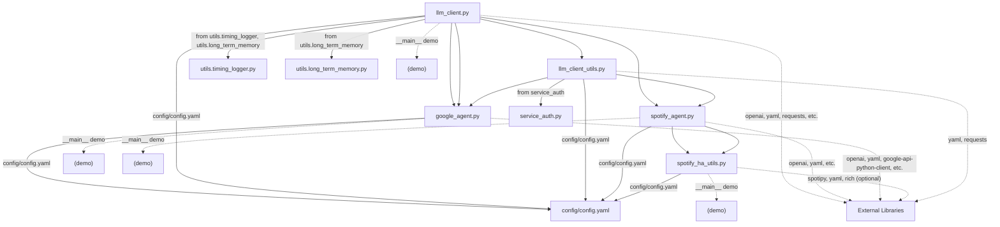

# AI Directory Structure

```mermaid
graph TD
  google_agent_py["google_agent.py"]
  llm_client_py["llm_client.py"]
  llm_client_utils_py["llm_client_utils.py"]
  spotify_agent_py["spotify_agent.py"]
  spotify_ha_utils_py["spotify_ha_utils.py"]

  %% Relationships inferred from imports and usage

  %% llm_client.py imports
  llm_client_py --> google_agent_py
  llm_client_py --> llm_client_utils_py
  llm_client_py -->|"from utils.timing_logger, utils.long_term_memory"| utils_timing_logger["utils.timing_logger.py"]
  llm_client_py -->|"from utils.long_term_memory"| utils_long_term_memory["utils.long_term_memory.py"]

  %% llm_client_utils.py imports
  llm_client_utils_py -->|"from service_auth"| service_auth["service_auth.py"]

  %% google_agent.py does not import local files

  %% spotify_agent.py imports
  spotify_agent_py --> spotify_ha_utils_py

  %% spotify_ha_utils.py does not import local files

  %% Cross-agent tool delegation
  llm_client_py --> spotify_agent_py
  llm_client_py --> google_agent_py

  %% llm_client_utils.py tools reference GoogleAgent and SpotifyAgent tools
  llm_client_utils_py --> google_agent_py
  llm_client_utils_py --> spotify_agent_py

  %% For clarity, show that llm_client.py and spotify_agent.py both use openai and yaml (external dependencies)
  llm_client_py -.->|"openai, yaml, requests, etc."| external_deps["External Libraries"]
  spotify_agent_py -.->|"openai, yaml, etc."| external_deps
  google_agent_py -.->|"openai, yaml, google-api-python-client, etc."| external_deps
  spotify_ha_utils_py -.->|"spotipy, yaml, rich (optional)"| external_deps
  llm_client_utils_py -.->|"yaml, requests"| external_deps

  %% Show config file dependency
  google_agent_py -->|"config/config.yaml"| config_yaml["config/config.yaml"]
  llm_client_py -->|"config/config.yaml"| config_yaml
  llm_client_utils_py -->|"config/config.yaml"| config_yaml
  spotify_agent_py -->|"config/config.yaml"| config_yaml
  spotify_ha_utils_py -->|"config/config.yaml"| config_yaml

  %% Show that spotify_agent.py uses spotify_ha_utils.SpotifyHA
  spotify_agent_py --> spotify_ha_utils_py

  %% Optionally, show test/demo entrypoints
  google_agent_py -.->|"__main__ demo"| demo_google["(demo)"]
  llm_client_py -.->|"__main__ demo"| demo_llm["(demo)"]
  spotify_agent_py -.->|"__main__ demo"| demo_spotify["(demo)"]
  spotify_ha_utils_py -.->|"__main__ demo"| demo_spotify_ha["(demo)"]
```
