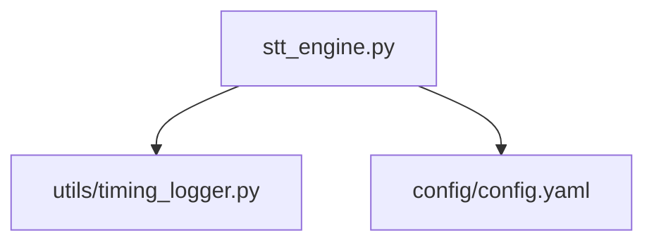

# AI Directory Structure

```mermaid
graph TD
    stt_engine_py["stt_engine.py"]
    timing_logger_py["utils/timing_logger.py"]
    config_yaml["config/config.yaml"]

    stt_engine_py --> timing_logger_py
    stt_engine_py --> config_yaml
```
