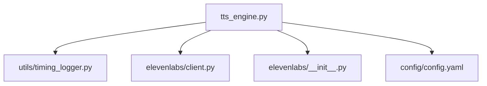

# AI Directory Structure

```mermaid
graph TD
    tts_engine_py["tts_engine.py"]
    utils_timing_logger_py["utils/timing_logger.py"]
    elevenlabs_client_py["elevenlabs/client.py"]
    elevenlabs_py["elevenlabs/__init__.py"]
    config_yaml["config/config.yaml"]

    tts_engine_py --> utils_timing_logger_py
    tts_engine_py --> elevenlabs_client_py
    tts_engine_py --> elevenlabs_py
    tts_engine_py --> config_yaml
```
